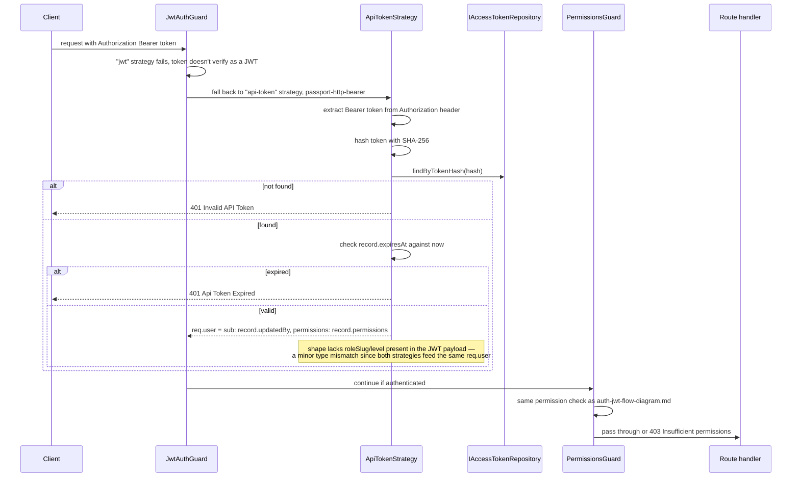
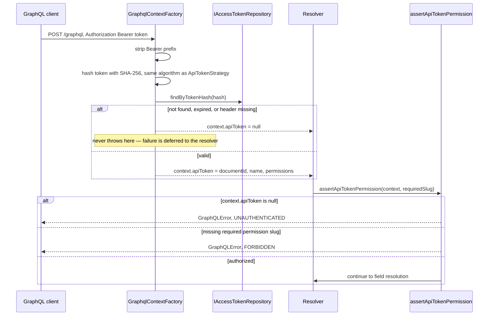
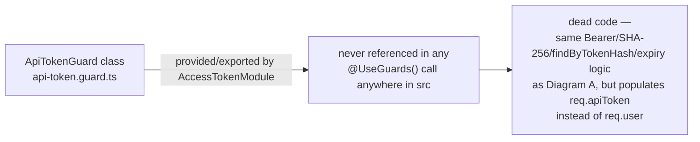

# Auth flow — API token (Bearer)

Scope: how a request carrying `Authorization: Bearer <token>` is authenticated. There
are **two independent implementations** in this codebase, plus one dead class — this
diagram shows all three so the diagram matches what actually runs. Read directly from
`src/common/strategies/api-token.strategy.ts`, `src/modules/access-tokens/**`,
`src/modules/graphql/infrastructure/graphql-context.factory.ts`, and
`src/modules/graphql/**/authorize.util.ts` — not inferred. Cross-referenced against
`docs/documents/access-tokens.md` and `docs/documents/graphql.md` for narrative context
only.

## Diagram A — REST path (wired, via JwtAuthGuard fallback)

## Diagram B — GraphQL path (separate manual reimplementation)

## Diagram C — the unwired standalone class

## Notes

- REST Bearer auth is handled by `ApiTokenStrategy` through `JwtAuthGuard`'s multi-strategy
  fallback — **not** by the standalone `ApiTokenGuard` class, despite the name similarity.
- GraphQL cannot use `@UseGuards()` at all because Apollo's `context()` factory is not a
  Nest route — so it reimplements the same hash/lookup/expiry logic inline rather than
  reusing either guard class.
- Token issuance: `CreateAccessTokenService` generates `cms_<64 hex chars>` via
  `randomBytes(32)`, stores only the SHA-256 hash, and returns the plaintext token exactly
  once — it is never retrievable again. No rotation mechanism exists.

Sources read: `src/common/strategies/api-token.strategy.ts`,
`src/modules/access-tokens/infrastructure/api-token.guard.ts`,
`src/modules/access-tokens/access-token.module.ts`,
`src/modules/graphql/infrastructure/graphql-context.factory.ts`,
`src/modules/graphql/**/authorize.util.ts`,
`src/modules/access-tokens/application/services/create-access-token.service.ts`.
