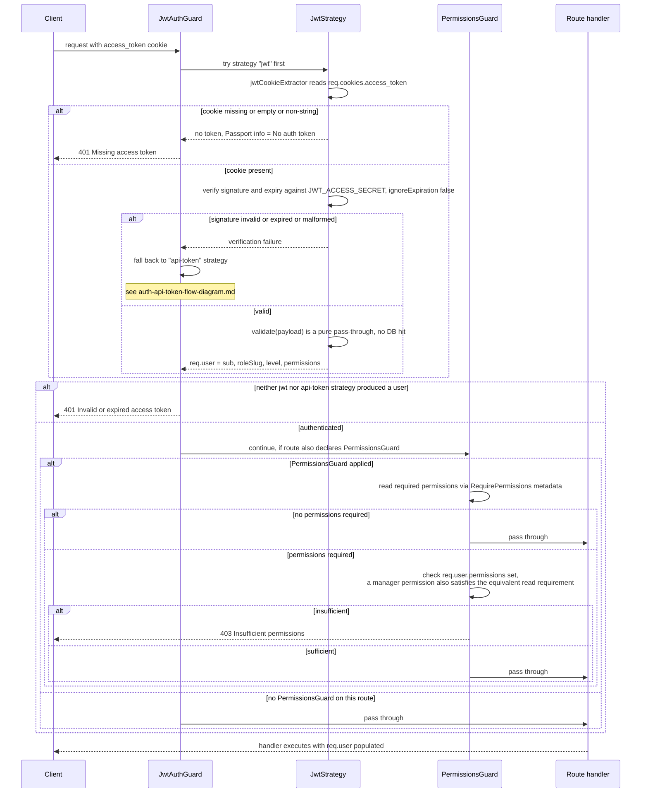

# Auth flow — JWT (cookie-based)

Scope: how a subsequent, already-logged-in request is authenticated and authorized via
the `access_token` cookie. Read directly from `src/common/guards/jwt-auth.guard.ts`,
`src/common/strategies/jwt.strategy.ts`, `src/common/guards/permissions.guard.ts` — not
inferred. Cross-referenced against `docs/documents/auth.md` for narrative context only.
See `login-flow-diagram.md` for how the cookie is first issued.

## Diagram — JWT verification sequence

## Notes

- `JwtAuthGuard extends AuthGuard(["jwt", "api-token"])` — it is a single guard class that
  tries two Passport strategies in order, not two separate guards. This is why the failure
  path falls back to the API-token strategy before finally returning 401 — see
  `auth-api-token-flow-diagram.md` for that branch's detail.
- `PermissionsGuard` is always paired after `JwtAuthGuard` via
  `@UseGuards(JwtAuthGuard, PermissionsGuard)` on every protected controller.
- `JwtStrategy.validate` never hits the database — all authorization data (`roleSlug`,
  `level`, `permissions`) is carried inside the signed JWT payload itself.

Sources read: `src/common/guards/jwt-auth.guard.ts`, `src/common/strategies/jwt.strategy.ts`,
`src/common/guards/permissions.guard.ts`.
