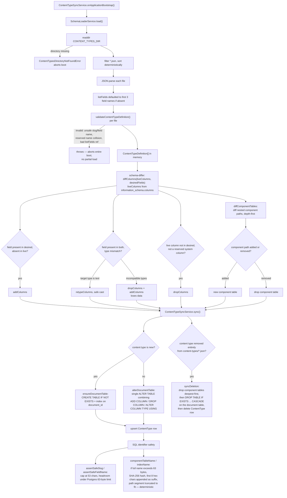

# Content-type → SQL table sync flow

Scope: the boot-time pipeline that turns `content-types/*.json` schema-as-code into
live Postgres tables/columns — schema loading, validation, diffing, and DDL. Read
directly from `src/modules/content-type/**` — not inferred. Cross-referenced against
`docs/documents/content-type.md` and `docs/adding-a-content-type.md` for narrative
context only.

## Diagram — boot-time sync pipeline

## Notes

- **Confirmed rule**: `DROP TABLE` is issued only from `syncDeletion` /
  `dropComponentTable` / `dropDocumentTable` — never from `alterDocumentTable` /
  `alterComponentTable`, which only ever emit `ADD/DROP COLUMN` or `ALTER COLUMN TYPE`.
- A field removed from the JSON while the content type itself stays *does* get its column
  actually `DROP COLUMN`ed — it is not left behind as an orphan column. "Never drop" applies
  at the table level only, not the column level.
- The `listFields` admin-mutable exception (`PATCH content-types/:slug/list-fields`,
  gated by `content_type:manager`) writes only a separate `listFieldsOverride` column —
  the sync engine above never reads or writes that column, so admin overrides survive
  every reboot's diff/sync pass untouched.
- Content-type module has zero imports of the document module anywhere under
  `src/modules/content-type/**` (confirmed by grep) — the module dependency arrow is
  one-way; `document` imports `content-type`, never the reverse.

Sources read: `src/modules/content-type/application/sync/content-type-sync.service.ts`,
`src/modules/content-type/application/schema/schema-loader.service.ts`,
`src/modules/content-type/application/schema/schema-validator.ts`,
`src/modules/content-type/application/sync/schema-differ.ts`,
`src/modules/content-type/infrastructure/persistence/prisma-schema-table.repository.ts`,
`src/modules/content-type/application/support/sql-identifier.ts`,
`src/modules/content-type/application/support/table-naming.ts`,
`src/modules/content-type/application/services/update-list-fields.service.ts`,
`src/modules/content-type/infrastructure/persistence/prisma-content-type.repository.ts`,
`content-types/cv-page.json`.
