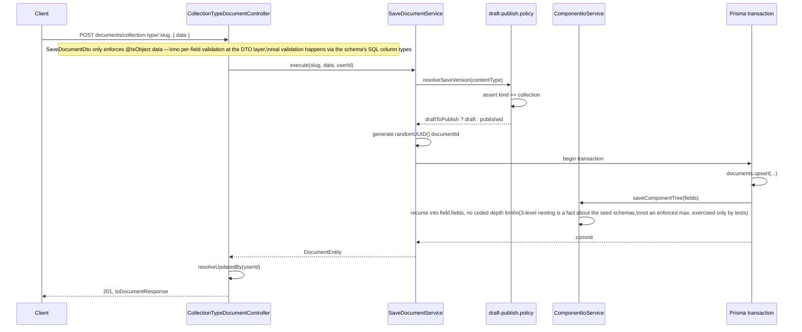
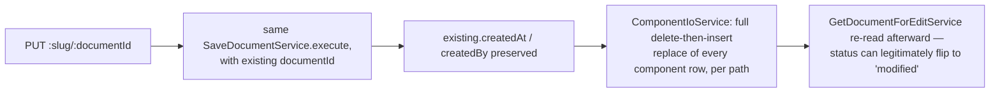
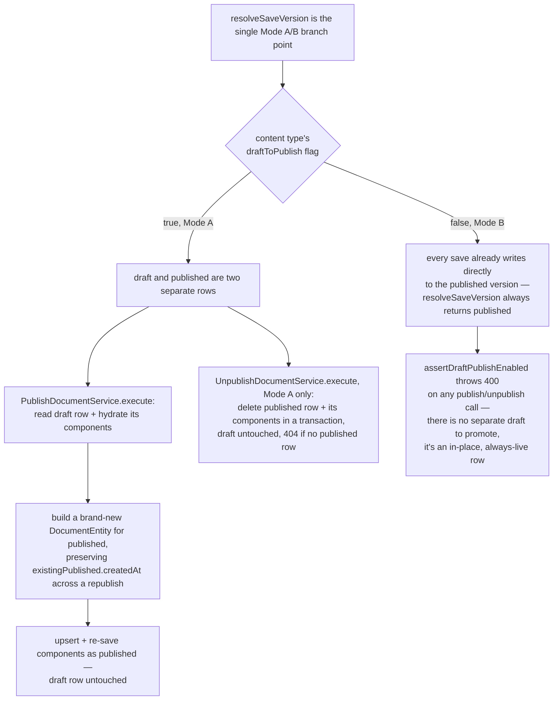
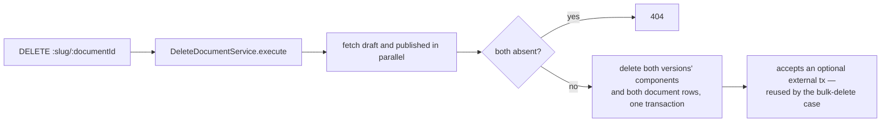
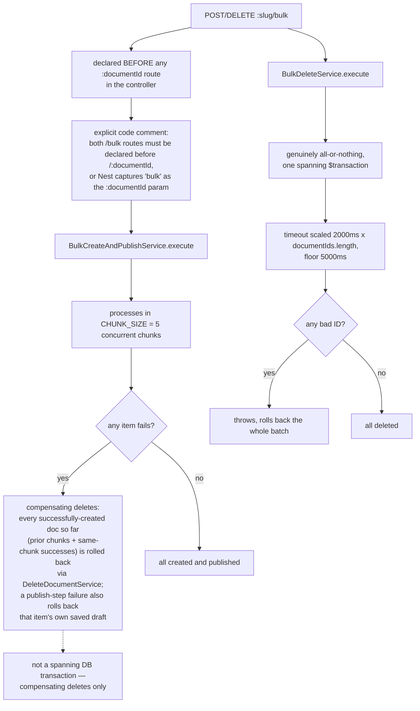
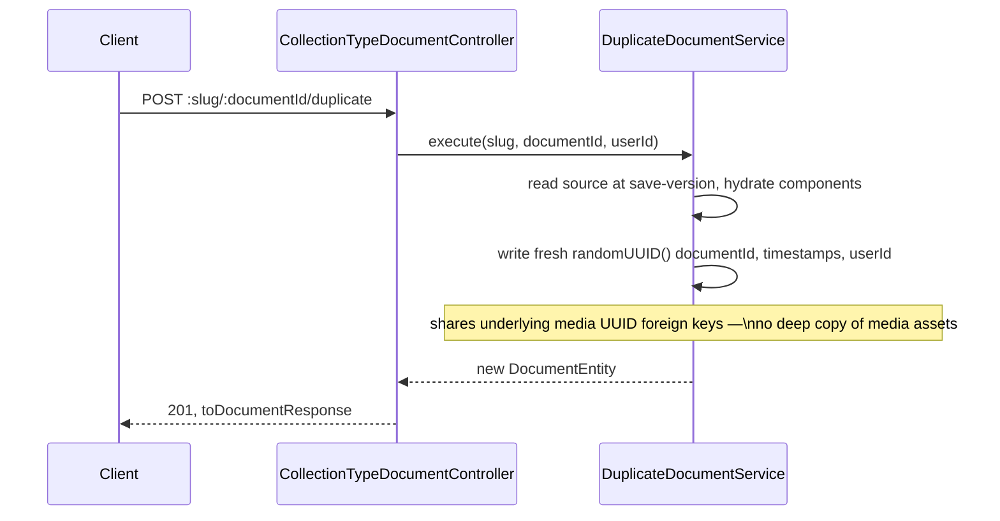
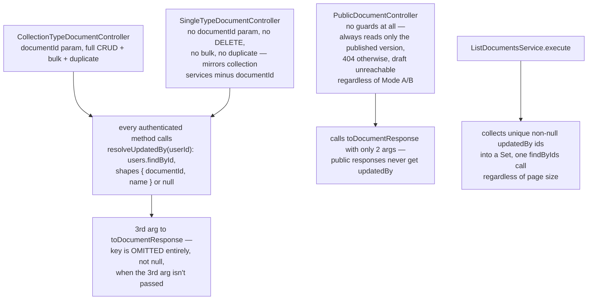

# Document flow — create / update / delete / publish / unpublish / bulk* / duplicate

Scope: the full document lifecycle for a collection-type, including the draft/publish
Mode A/B split, bulk operations, duplicate, and how REST surfaces (single-type,
collection-type, public) differ. Read directly from `src/modules/document/**` — not
inferred. Cross-referenced against `docs/documents/document.md` for narrative context
only. There is no "clone" endpoint anywhere in this module — only "duplicate" — confirmed
by source search, not assumed.

## Diagram A — create

## Diagram B — update

## Diagram C — publish / unpublish, Mode A vs Mode B

## Diagram D — delete

## Diagram E — bulk create + publish, bulk delete

## Diagram F — duplicate

## Diagram G — REST surface differences and `updatedBy`

Sources read: `src/modules/document/presentation/collection-type-document.controller.ts`,
`src/modules/document/presentation/single-type-document.controller.ts`,
`src/modules/document/presentation/public-document.controller.ts`,
`src/modules/document/application/services/save-document.service.ts`,
`src/modules/document/application/services/publish-document.service.ts`,
`src/modules/document/application/services/unpublish-document.service.ts`,
`src/modules/document/application/services/delete-document.service.ts`,
`src/modules/document/application/services/duplicate-document.service.ts`,
`src/modules/document/application/services/bulk-create-publish.service.ts`,
`src/modules/document/application/services/bulk-delete.service.ts`,
`src/modules/document/application/services/list-documents.service.ts`,
`src/modules/document/application/support/draft-publish.policy.ts`,
`src/modules/document/application/support/component-io.service.ts`,
`src/modules/document/presentation/document-response.mapper.ts`.
