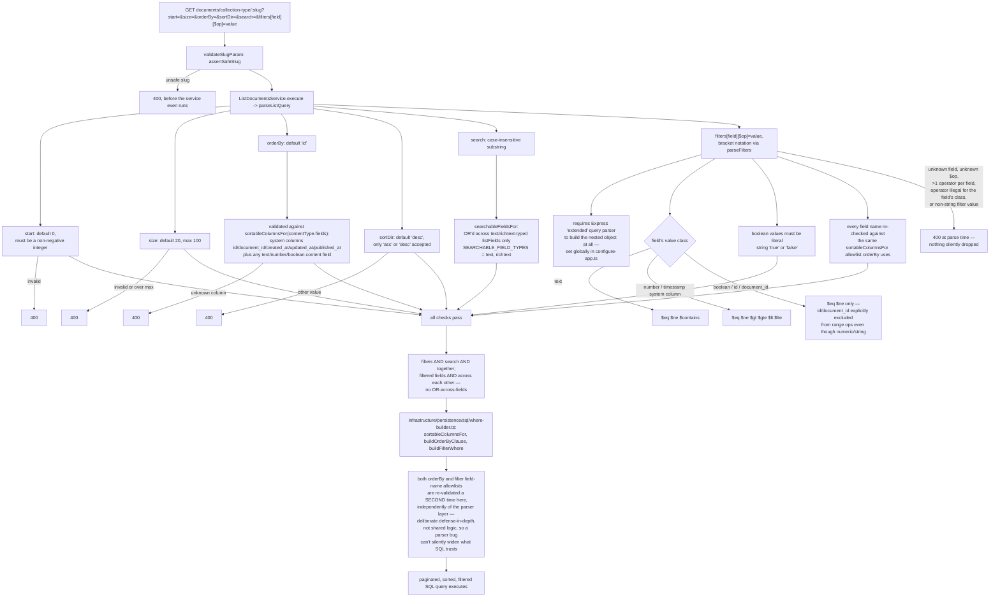

# Document flow — sort / filter / pagination (REST)

Scope: the collection-list REST endpoint's query-parameter parsing for pagination,
sort, search, and filters. Read directly from `src/modules/document/**` (`list-query.dto.ts`,
`list-query.parser.ts`, `filter-query.parser.ts`, `where-builder.ts`) — not inferred.
Cross-referenced against `docs/cms-admin-integration.md` for narrative context only, not
as the source of truth. See `graphql-pagination-flow-diagram.md` for the equivalent
GraphQL mechanism, which is a fully separate implementation.

## Diagram — parsing `GET /documents/collection-type/:slug`

## Notes

- Every validation failure (`start`, `size`, `orderBy`, `sortDir`, or any filter clause)
  throws `400 BadRequestException` at parse time, before any repository call — there is no
  silent fallback to defaults on bad input for filters, only for genuinely omitted params.
- The double-validation (parser layer, then `where-builder.ts` again) is intentional
  defense-in-depth, not an oversight or duplicated logic to simplify.

Sources read: `src/modules/document/presentation/dto/list-query.dto.ts`,
`src/modules/document/application/support/list-query.parser.ts`,
`src/modules/document/application/support/filter-query.parser.ts`,
`src/modules/document/infrastructure/persistence/sql/where-builder.ts`,
`src/modules/document/presentation/validate-params.ts`,
`src/bootstrap/configure-app.ts`.
