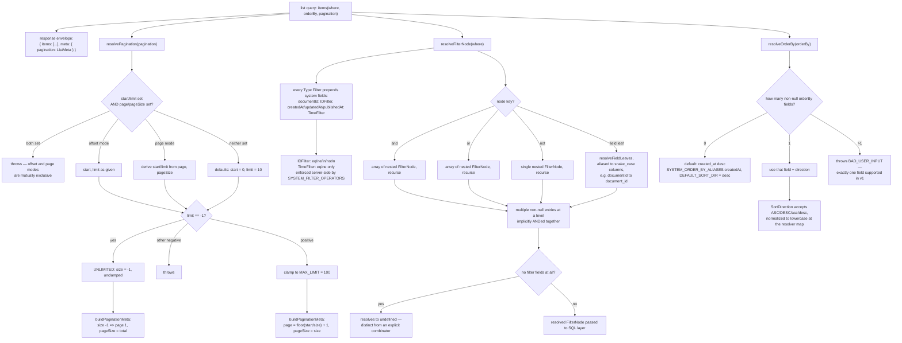

# GraphQL — sort / filter / pagination flow

Scope: how a list query's `where`, `orderBy`, and `pagination` arguments are resolved
into a SQL-ready shape and how the response envelope is built. Read directly from
`src/modules/graphql/**` (`schema-builder.service.ts`, `list-args.translator.ts`,
`resolver-factory.service.ts`) — not inferred. Cross-referenced against
`docs/documents/graphql.md` for narrative context only.

## Diagram — resolving a list query's arguments

## Notes

- `PaginationInput` fields (`start`, `limit`, `page`, `pageSize`) are all nullable in the
  SDL — the offset/page mode distinction is enforced entirely at resolution time, not by
  the schema.
- `limit: -1` is the documented "unlimited" sentinel; any other negative value is a hard
  error, not silently clamped.
- The empty-filter branch (`where` present but every field null) is deliberately distinct
  from `and: []` / `or: []` — it resolves to `undefined` rather than an empty combinator
  node.

Sources read: `src/modules/graphql/application/schema-builder.service.ts`,
`src/modules/graphql/application/list-args.translator.ts`,
`src/modules/graphql/application/resolver-factory.service.ts`.
