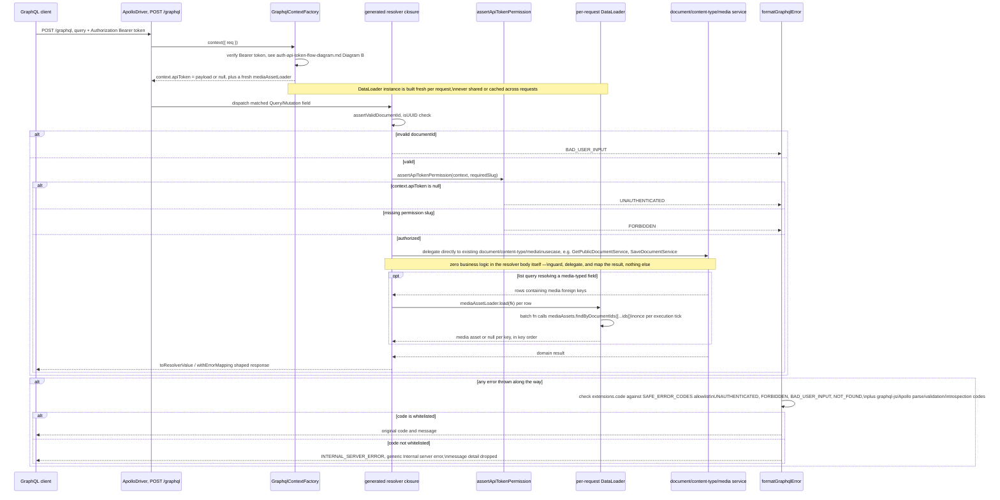

# GraphQL — query execution flow

Scope: how a single `POST /graphql` request is authenticated, dispatched to a resolver,
and turned into a response — including media-field DataLoader batching and error
formatting. Read directly from `src/modules/graphql/**` — not inferred. Cross-referenced
against `docs/documents/graphql.md` for narrative context only. See
`graphql-schema-generation-flow-diagram.md` for how the resolvers were built, and
`auth-api-token-flow-diagram.md` Diagram B for the auth sub-flow reused here.

## Diagram — single query/mutation execution

## Notes

- Auth cannot use `@UseGuards()` here since Apollo's `context()` factory is not a Nest
  route — `GraphqlContextFactory` reimplements the Bearer/SHA-256/lookup/expiry logic
  inline rather than invoking `ApiTokenGuard`, and it never throws — failure just yields
  `apiToken: null`, deferring the actual 401/403 decision to each resolver.
- The DataLoader batches media-field resolution specifically (fixed for the N+1 case on
  list queries); it does not batch `ListDocumentsFullService`'s own component/media
  row-hydration, which remains a documented, accepted N+1.
- Introspection and the GraphQL Playground are both gated on
  `process.env.NODE_ENV !== "production"` — a deny-list that fails open if `NODE_ENV` is
  unset, a deliberate trade-off per `docs/documents/graphql.md`.

Sources read: `src/modules/graphql/graphql.module.ts`,
`src/modules/graphql/infrastructure/graphql-context.factory.ts`,
`src/modules/graphql/application/resolver-factory.service.ts`,
`src/modules/graphql/**/authorize.util.ts`,
`src/modules/graphql/**/format-error.util.ts`.
