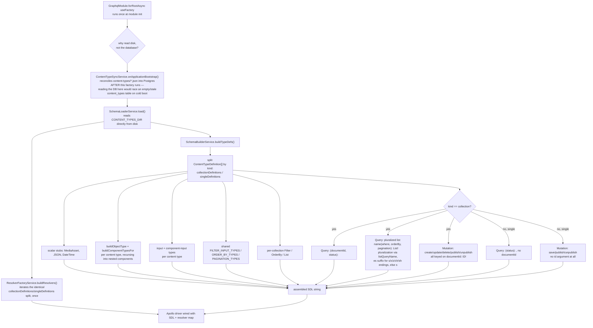

# GraphQL — create schema flow

Scope: how the GraphQL SDL and resolvers are built once at boot, directly from
`content-types/*.json`, without touching the database. Read directly from
`src/modules/graphql/**` — not inferred. Cross-referenced against
`docs/documents/graphql.md` for narrative context only.

## Diagram — boot-time SDL/resolver build

## Notes

- Both `SchemaBuilderService` and `ResolverFactoryService` call `SchemaLoaderService.load()`
  independently — the generated schema is a snapshot of disk at boot, not the live database.
- Collection-type and single-type shapes diverge specifically on the presence of
  `documentId`: collection mutations/queries are always keyed on it, single-type ones never
  take it since there is exactly one row per single type.

Sources read: `src/modules/graphql/graphql.module.ts`,
`src/modules/graphql/application/schema-builder.service.ts`,
`src/modules/graphql/application/resolver-factory.service.ts`,
`src/modules/graphql/application/naming.ts`,
`src/modules/content-type/application/schema/schema-loader.service.ts`.
