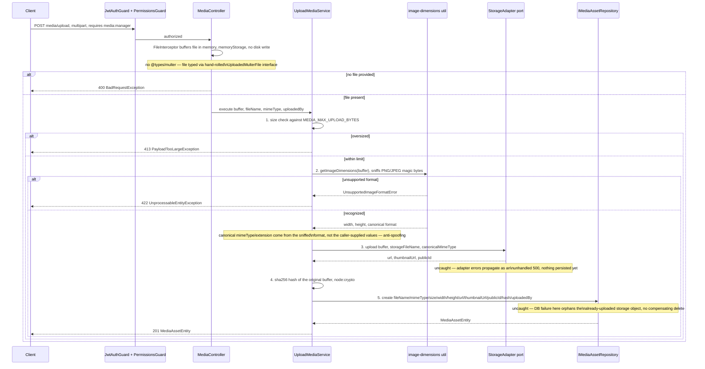
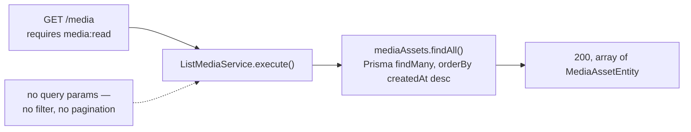
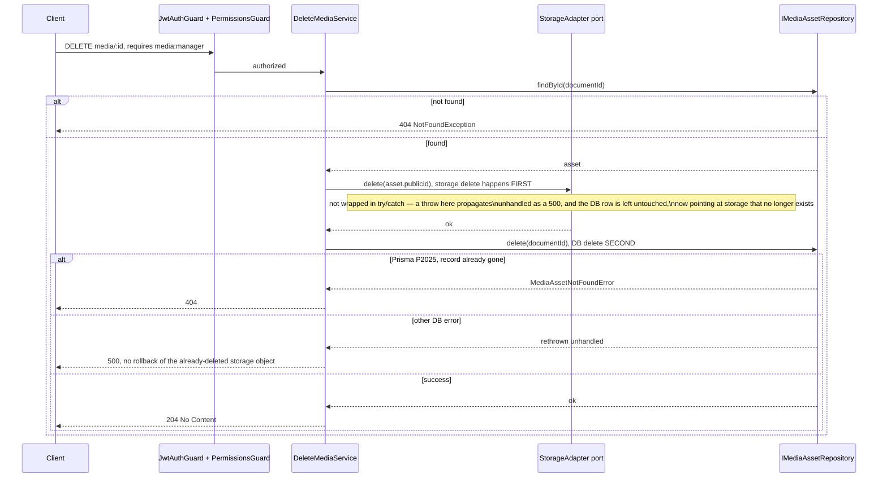
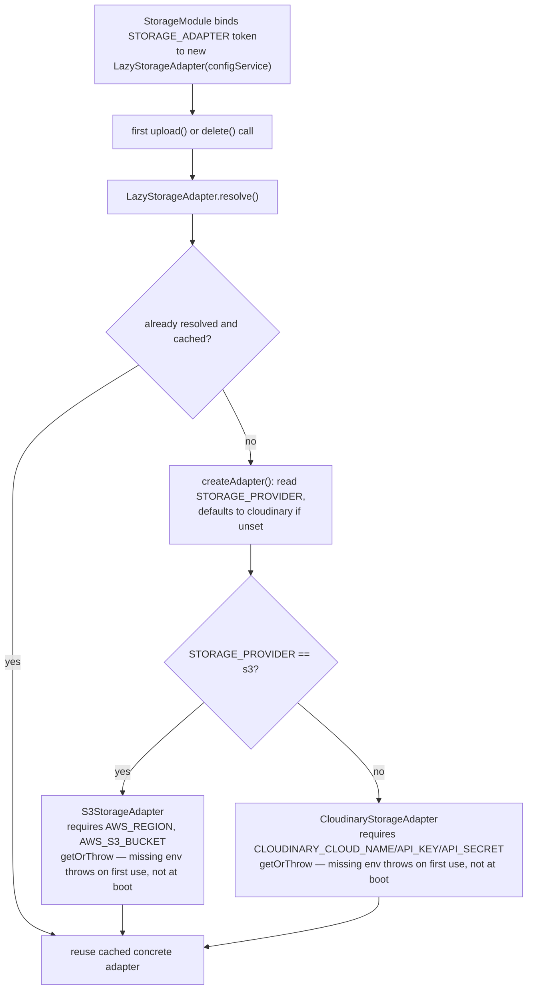

# Media flow — upload / list / delete

Scope: the media module's three operations and how the storage adapter is resolved.
Read directly from `src/modules/media/**` and `src/modules/storage/**` — not inferred.
Cross-referenced against `docs/documents/media.md` and `docs/documents/storage.md` for
narrative context only.

## Diagram A — upload

## Diagram B — list

## Diagram C — delete

## Diagram D — storage adapter resolution

## Notes

- Confirmed exact upload ordering: **size → dimension → storage → hash → persist**.
- S3 adapter: randomized key, `PutObjectCommand`/`DeleteObjectCommand`; `url` and
  `thumbnailUrl` are identical (no real thumbnail generation).
- Cloudinary adapter: base64 data-URI upload with an eager 200×200 thumbnail transform;
  `thumbnailUrl` falls back to `secure_url` if the eager transform result is absent.

Sources read: `src/modules/media/presentation/media.controller.ts`,
`src/modules/media/application/services/upload-media.service.ts`,
`src/modules/media/application/services/list-media.service.ts`,
`src/modules/media/application/services/delete-media.service.ts`,
`src/modules/media/infrastructure/persistence/prisma-media.repository.ts`,
`src/modules/media/application/support/image-dimensions.util.ts`,
`src/modules/storage/storage.module.ts`,
`src/modules/storage/infrastructure/lazy-storage.adapter.ts`,
`src/modules/storage/infrastructure/s3-storage.adapter.ts`,
`src/modules/storage/infrastructure/cloudinary-storage.adapter.ts`.
