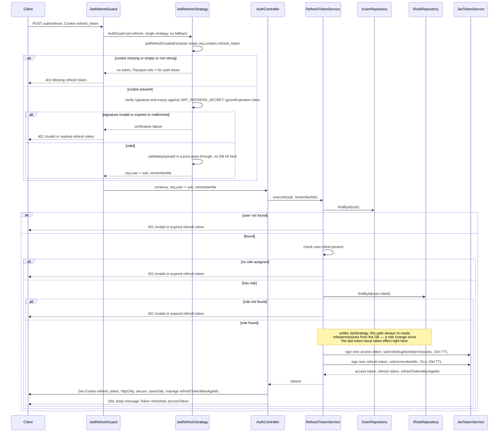

# Refresh token flow — rotation and logout

Scope: `POST /auth/refresh` and `POST /auth/logout`, from the `refresh_token` cookie to
response (a rotated `accessToken` in the JSON body plus a rotated `refresh_token`
cookie). Read directly from `src/common/strategies/jwt-refresh.strategy.ts`,
`src/common/guards/jwt-refresh.guard.ts`,
`src/modules/auth/application/services/refresh-token.service.ts`, and
`src/modules/auth/presentation/auth.controller.ts` — not inferred. Cross-referenced
against `docs/documents/auth.md` for narrative context only. See
`login-flow-diagram.md` for how the pair is first issued and
`auth-jwt-flow-diagram.md` for how the access token is verified on every other request.

## Diagram — refresh sequence



## Diagram — logout

```mermaid
sequenceDiagram
    participant C as Client
    participant Ctl as AuthController

    C->>Ctl: POST auth/logout
    Ctl->>C: clearCookie refresh_token
    Ctl-->>C: 200, message Logged out
    Note over Ctl: no strategy, no guard, no DB write here —<br/>this only clears the refresh_token cookie on the caller's own browser;<br/>the client is responsible for discarding its in-memory access token
```

## Notes

- **Rotation, not reuse.** Every successful refresh issues a brand-new access/refresh
  pair — the new access token comes back in the response body, the new refresh token
  overwrites the `refresh_token` cookie; the refresh token just consumed is not
  server-side invalidated — it stays cryptographically valid, if replayed, until it
  naturally expires.
- **The one place a refresh differs from a plain authenticated request:**
  `JwtStrategy.validate` (access token, every other route) never touches the
  database — `RefreshTokenService.execute` (this flow) always re-fetches `User` and
  `Role` from Postgres before signing the next access token. That is the mechanism
  by which a permission or role change actually reaches an already-logged-in session.
- **Logout ≠ revoke.** `POST /auth/logout` only calls `res.clearCookie()` once
  (`refresh_token` — there's no `access_token` cookie left to clear). There
  is no `refresh_tokens` table, no Redis, no blacklist anywhere in this service — see
  `docs/documents/auth.md:76`: *"No server-side token revocation. Access/refresh JWTs
  are never persisted; a leaked refresh token remains valid until it naturally
  expires… or is rotated out by a subsequent legitimate refresh."* A leaked access
  token is exploitable for at most 15 minutes; a leaked refresh token for up to 30
  days if `rememberMe` was set — that window is the accepted cost of staying
  stateless.
- **`JwtRefreshGuard` has no fallback strategy** (unlike `JwtAuthGuard`, which tries
  `jwt` then `api-token`) — a missing or invalid refresh cookie fails immediately.

Sources read: `src/common/strategies/jwt-refresh.strategy.ts`,
`src/common/guards/jwt-refresh.guard.ts`,
`src/modules/auth/application/services/refresh-token.service.ts`,
`src/modules/auth/presentation/auth.controller.ts`,
`src/common/token/jwt-token.service.ts`, `docs/documents/auth.md`.
