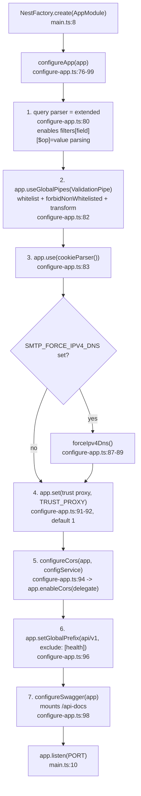
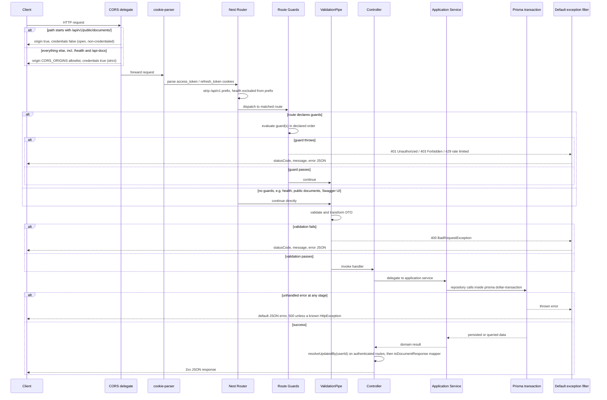

# Request lifecycle — income to outcome

Scope: how an inbound HTTP request travels through this API end to end — boot-time
wiring, middleware, guards, validation, controller → service → repository dispatch,
response shaping, and error handling. Read directly from `src/main.ts`,
`src/bootstrap/configure-app.ts`, `src/common/guards/*`, `src/app.controller.ts`, and
`src/config/env.validation.ts` — not inferred. Cross-referenced against
`docs/documents/cors.md` and `docs/documents/swagger.md` for narrative context only.

Key facts that shape the diagram: there are **no global** `APP_GUARD` / `APP_INTERCEPTOR`
/ `APP_FILTER` providers anywhere in `src` — every guard is attached per-route/per-controller
via `@UseGuards`, there is no response-transform interceptor, and there is no custom
exception filter. The only global pipeline elements are the `ValidationPipe`,
`cookie-parser` middleware, and the CORS delegate.

## Diagram A — boot-time wiring

## Diagram B — per-request pipeline

## Notes / branch summary

- `/health` bypasses the global prefix and has no guards (`app.controller.ts:5-8`) but still
  passes through CORS + cookie-parser (Express-level middleware, ahead of routing).
- `/api-docs` (Swagger UI) and `/graphql` (Apollo, its own `context()` / `formatError`) are
  the two routes that run outside this per-route-guard pipeline — GraphQL has its own
  parallel auth/error pipeline, see `graphql-query-flow-diagram.md`.
- `ApiTokenGuard` (`api-token.guard.ts`) is defined and exported but never attached via
  `@UseGuards` anywhere — Bearer-token REST auth actually flows through `JwtAuthGuard`'s
  multi-strategy fallback, see `auth-api-token-flow-diagram.md`.
- No custom `@Catch()` exception filter exists in `src` — every thrown `HttpException`
  (and any uncaught error) falls through to Nest's built-in default filter, producing
  `{ statusCode, message, error }`. There is no app-specific error envelope.
- No `helmet` and no global body-parser call — Express's bundled JSON/urlencoded parsing
  (via `NestExpressApplication`) is what is active; rate limiting is a per-route guard
  (`RateLimitGuard`), not global middleware.

Sources read: `src/main.ts`, `src/bootstrap/configure-app.ts`, `src/common/guards/*`,
`src/app.controller.ts`, `src/config/env.validation.ts`.
